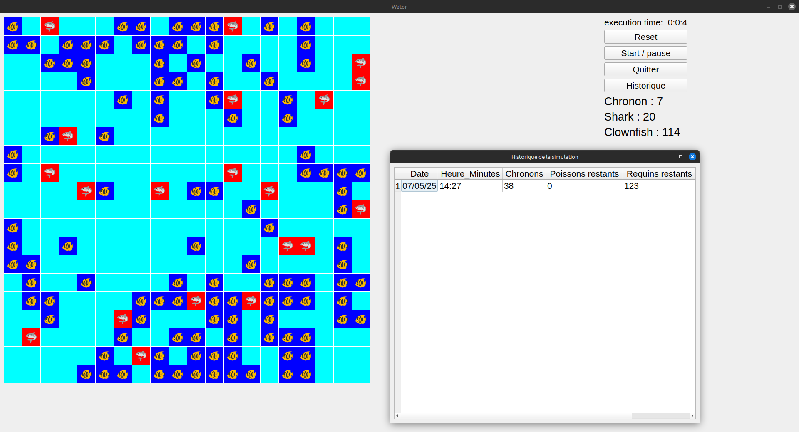

# Wator_Groupe1


## Description du projet 

Une simulation de dynamique de population avec des requins et des poissons codés en Python.
Ce projet a été réalisé par [Aurelien](https://github.com/Aurelien-L), [Benjamin](https://github.com/benjsant) et [Sayana](https://github.com/sayana-project) lors de la formation Dev IA chez Simplon HDF-Lille. L'objectif est de créer une simulation (Wa-Tor) utilisant le langage de programmation Python, avec une interface graphique développée en PyQt5.

- Pour en savoir plus sur la simulation Wa-Tor, consultez [cette page Wikipedia](https://en.wikipedia.org/wiki/Wa-Tor).

## Arborescence du projet 

Voici l'arborescence du projet pour mieux localiser certains fichiers : 

- **interface/** : Dossier contenant les fichiers liés à l'interface utilisateur.
  - **grid_view.py** : Fichier pour la vue de la grille.
  - **main_window.py** : Fichier pour la fenêtre principale de l'application.
  - **history_window.py**: Fichier pour le tableau d'historique des simulations. 
- **entity/** : Dossier contenant les entités du projet.
  - **`__init__.py`** : Fichier d'initialisation du module.
  - **fish.py** : Fichier pour la classe représentant le poisson.
  - **shark.py** : Fichier pour la classe représentant le requin.
  - **clown_fish.py**:Fichier pour la sous-classe de poisson représentant le poisson tropical.  
- **utils/** : Dossier contenant des utilitaires.
  - **config.py** : Fichier de configuration.
  - **data_manager.py**: Fichier pour la gestion de données, principalement la sauvegarde des simulations passées.
- **main.py** : Point d'entrée de l'application.
- **planet.py** : Fichier pour la classe représentant une planète.
- **README.md** : Documentation du projet.
- **history_wator_groupe1.csv** : Fichier CSV de sauvegarde des simulations précédentes. 

## Utilisation du projet 

### Pré-requis et installation 

1. **Cloner le projet** : Pour utiliser l'application, téléchargez le Zip du projet depuis GitHub en [cliquant ici](https://github.com/benjsant/wator_groupe1.git).

   Vous pouvez également exécuter la commande suivante si vous avez **Git** installé sur votre machine :

```bash
git clone https://github.com/benjsant/wator_groupe1.git
```

1. **Installer Python et les dépendances** : Assurez-vous d'avoir Python 3.13 installé sur votre machine puis avec un terminal de commande, installez les dépendances nécessaires avec la commande ci-dessous:  
  
```bash
pip install -r requirements.txt
```

2. **Mise en route du programme** : Une fois toutes vos dépendances Python installées vous pouvez mettre en route le programme avec la commande suivante: 
```python
python main.py 
```
Ou vous pouvez lancer le programme dans votre éditeur de code, veuillez vous positionner dans main.py. 

## **Paramètres de la simulation.** 
Tous les paramètres importants de la simulation sont dans le fichier **utils/config.py** nous avons: 

- **Configuration de la grille :**
  - **rows** : Nombre de lignes de l'interface.
  - **columns** : Nombre de colonnes de l'interface.
  
- **Configuration des chronons(le temps) :**
  - **max_chronons** : Nombre de chronons max.
  - **cycle_time** : vitesse en milliseconde du programme (ex: 5000 = 5 secondes).
  
- **Configuration des Poissons :**
  - **number_of_fishes**: Nombre de poisson initialisés dans l'interface. 
  - **fish_reproduction_time** : Nombre de chronon nécessaire pour créer de nouveaux poissons.
  
- **Configuration des Requins :**
  - **number_of_sharks** : Nombre de requins initialisés dans l'interface.
  - **shark_reproduction_time** : Nombre de chronon nécessaire pour créer de nouveaux requins.
  - **shark_starting_energy** : Énergie des requins, quand cette valeur est à 0 le requin disparaît.
  - **energy_by_eating**: Énergie que récupère un requin en mangeant un poisson.  
  
## **Contributions des membres de l'équipe** 
   
- **[Aurelien](https://github.com/Aurelien-L)**: 
  - Création UML 
  - Création classe Shark
  - Modification classe Planet 
  - Modification classe Fish avec création classe ClownFish
  - Implémentation logique de déplacement des organismes dans la grille 
  - Actions de reproduction des entités et d'alimentation des requins 
  
- **[Benjamin](https://github.com/benjsant)**: 
  - Création dépôt git avec les branches 
  - Création classe Fish
  - Création README.md et requirements.txt
  - Création fonctionnement historique 
  - Soutien au debogage Aurelien et Sayana 
  - Création classe HistoryWindow avec son interface graphique 
  
- **[Sayana](https://github.com/sayana-project)**:
  - Création classe Planet 
  - Création de la grille matricielle
  - Gestion des chronons dans la classe Planet 
  - Création classe GridView
  - Création classe MainWindow
  - Création interface graphique PyQt5
  